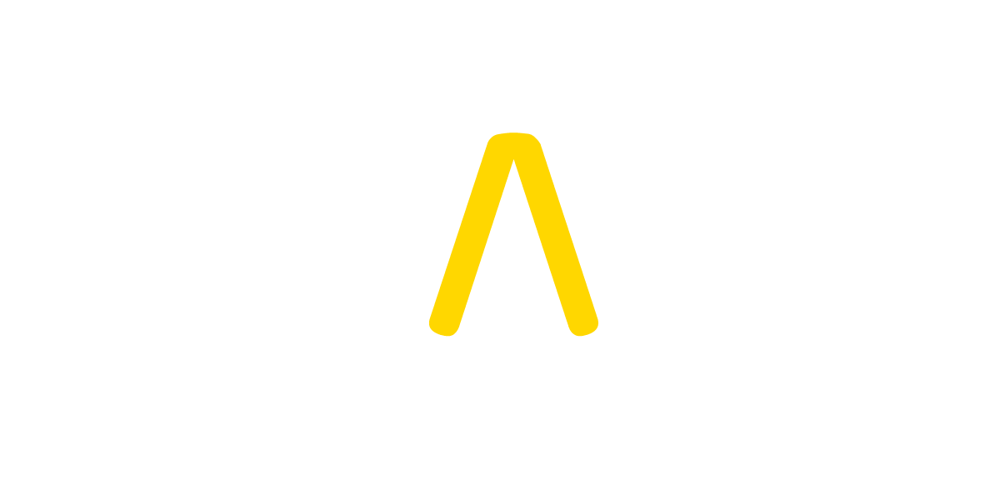

# Tatakai Marketplace



## Introduction

Notre marketplace, à l’instar d’un géant comme "Sorare", propose l’achat-vente de NFT à l’effigie de combattant professionnels pluridisciplinaire avec une gamification autour de leur actualité via une scoremap exclusive et innovante, donnant ainsi une nouvelle synergie à ce marché en plein essor.

## Fonctionnalités

- Mint de NFTs
- Achat-vente de NFTs avec ERC-20 (TAK)
- Swap ETH/TAK

## Installation & Lancement

### Lancer un client Ethereum
L'utilisation de Ganache est **recommandé**, téléchargez [Ganache] et lancez l'application. Cela lancera une blockchain local sur le port 7545.

Ou vous pouvez utiliser Ganache-CLI (s'il n'est pas encore installé) avec `npm install -g ganache-cli` puis `ganache-cli` qui fonctionnera sur le port 8545.

### Déployer les contrats
Déployer les contrats sur le réseau Matic.

```sh
truffle deploy --network matic
```

### Installer les dépendances
Lancez les commandes suivantes dans le terminal :
```sh
cd server
npm install
cd ..
cd client
npm install
```

### Lancer les tests
```sh
truffle test
```

### Lancer la DApp
Dans un premier terminal, lancez les commandes suivantes pour démarrer le serveur :
```sh
cd server
node index.js
```
Puis, dans un second terminal, lancez les commandes suivantes pour démarrer React :
```sh
cd client
npm start
```

## Technologies

- [Truffle Suite] - Framework de développement Ethereum. Il permet d'interfacer des smart contracts avec du code JavaScript et l'ensemble de l'écosystème NodeJS.
- [React] - Bibliothèque JavaScript open-source qui est utilisée pour construire des interfaces utilisateur spécifiquement pour des applications d'une seule page. 
- [Material UI] - Librairie de composants React qui implémentent les guidelines de Google en terme de Material Design que l’on retrouve dans les interface des applications Google comme Gmail, Google Photos ou encore dans les applications Android.
- [Node.js] - Environnement d'exécution permettant d’utiliser le JavaScript côté serveur. 
- [Express] - Framework pour construire des applications web basées sur Node.js
- [IPFS] - Protocole P2P permettant de décentraliser l'hébergement de fichiers.
- [Pinata Cloud] - API qui permet de stocker et de gérer des fichiers sur IPFS.
- [Matic Network] - Solution de seconde couche d’Ethereum.


   [Pinata Cloud]: <https://pinata.cloud/>
   [IPFS]: <https://ipfs.io/>
   [Matic Network]: <https://matic.network/>
   [Node.js]: <http://nodejs.org>
   [Express]: <http://expressjs.com>
   [React]: <https://fr.reactjs.org/>
   [Truffle Suite]: <https://www.trufflesuite.com/>
   [Material UI]: <https://material-ui.com/>
   [Ganache]: <https://truffleframework.com/ganache>

## Perspective d'évolution

- Mise en place de la Gamification sous forme de pari. Sur une période donnée, l'utilisateur aura la possibilité de parier sur les prochains matchs de 3 de ses combattants qu'il possède dans son deck. Ainsi il mettra ses cartes en jeu lui donnant le droit de parier sur ces combattants, il sera alors en mesure de spécifier plus précisément sur les combats à venir (victoire par Ko, numero de round, ...) pour augmenter son indice de difficulté. Si le joueur possède des cartes rares/légendaires ou Unique son indice de difficulté sera augmenté en fonction. A l'issu de la période de pari, une grille de récompense offrira les gains associés en fonction du classement du user. Il pourra ainsi remporter des cartes uniques ou encore simplement des TAK token.
